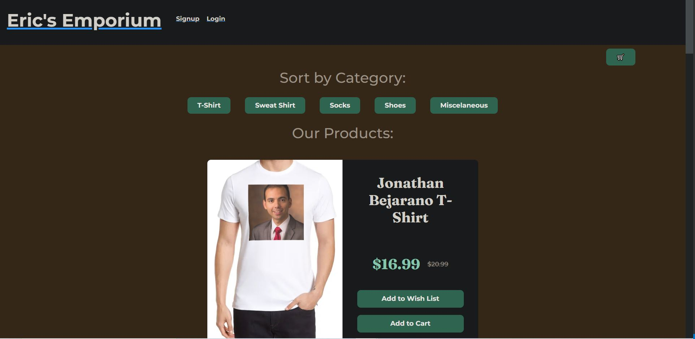

# Eric's Emporium
[](https://opensource.org/licenses/MIT)
  <!-- PROJECT LOGO -->

## Description

Eric's Emporium is a one stop shop for all of your apparel needs. need some clothes with crazy styles? you name it we got it. This website was created using the MERN stack to show our proficiency with the tools included. Our motivation was to build a fast responding E-commerce site that a user could add items to a wishlist or to their cart. 

<!-- Put a Screen Shot here -->

## Table of Contents

* [Installation](#installation)

* [Usage](#usage)

* [Deployed Site](#deployed-site)

* [License](#license)

* [Features](#features)

* [Contributors](#contributors)

* [Questions](#questions)


  
 ## Installation

Run ``` npm install ``` to install all dependencies, then either ```npm develop``` or ```npm build``` for development/production respectively.

## Usage

Run ``` npm start ``` to run the website.

## Deployed Site

[deployed to Heroku](https://erics-emporium.herokuapp.com/)

## Image of Deployed Site



## License

This project is licensed under MIT.

## Features

If the user adds items to their wishlist it would be stored to that user and no matter what device the user is on they will still have the wishlist. Once the user signsup and logins than they will be able to add to their cart and checkout.


## Contributors
  

    Lucas Freigenberg-Full Stack Developer
  <p align="left">Linkedin: <a href="#https://www.linkedin.com/in/lucas-freigenberg-539338134/">lucas-freigenberg</a></p>
  <p align="left">Github: <a href="#https://github.com/mountaindriver">mountaindriver</a></p>
  <p align="left">Email: <a href="#Lsfreigenberg@outlook.com">Lsfreigenberg@outlook.com</a></p>


    Courage Cottrell
  <p align="left">Linkedin: <a href="https://www.linkedin.com/in/courage-cottrell-b44172161/">Courage Cottrell</a></p>
  <p align="left">Github: <a href="#https://github.com/ccottrell52">ccottrell</a></p>
  <p align="left">Email: <a href="#courage.cottrell@gmail.com">courage.cottrell@gmail.com</a></p>
  
  
    Colton Vincent
  <p align="left">Linkedin: <a href="#https://www.linkedin.com/in/colton-vincent-b44172161/">Colton Vincent</a></p>
  <p align="left">Github: <a href="#https://github.com/ColtonVincent">ColtonVincent</a></p>
  <p align="left">Email: <a href="#Cvinny33@gmail.com">Cvinny33@gmail.com</a></p>
    
    James Jabar
  <p align="left">Linkedin: <a href="#https://www.linkedin.com/in/james-jabar-b16064240/">James Jabar</a></p>
  <p align="left">Github: <a href="#https://github.com/jibba6">jibba6</a></p>
  <p align="left">Email: <a href="#jabar.james.jj@gmail.com"> jabar.james.jj@gmail.com</a></p>
 
    Nick Goshev
  <p align="left">Linkedin: <a href="#https://www.linkedin.com/in/nicholas-goshev-931844205/">Nick Goshev</a></p>
  <p align="left">Github: <a href="#https://github.com/nickgoshev">nickgoshev</a></p>
  <p align="left">Email: <a href="#nickgosh420@gmail.com">nickgosh420@gmail.com</a></p>
  
  <p align="right">(<a href="#readme-top">back to top</a>)</p>
  yay
  
  ## Questions
  
  If you have any questions feel free to reach out to us using any of the email adresses listed above. 
